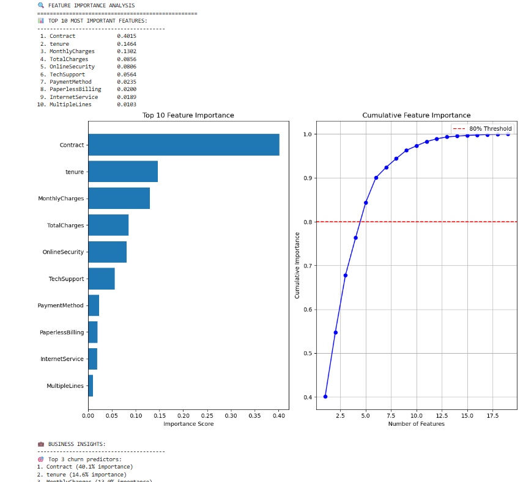

# Customer Churn Predictor

A comprehensive data analysis project identifying customer churn patterns and quantifying revenue impact using Python and PostgreSQL.

## Problem Statement

Analyze customer churn behavior to identify at-risk customers and develop data-driven retention strategies for a telecommunications company.

## Key Findings

- **Contract type is the primary churn predictor** (40.1% feature importance)
- Month-to-month customers have **6x higher churn rates** (42.7% vs 6.8%)
- **$1.67M annual revenue at risk** from customer churn
- Two-year customers generate **2.7x higher lifetime value** despite 8.5% discount

## Technical Approach

### Data Analysis (Python)
- Exploratory data analysis with pandas and matplotlib
- Feature engineering and statistical analysis
- Machine learning model comparison (Gradient Boosting achieved 84.4% ROC-AUC)

### Database Design (PostgreSQL)
- Normalized database schema with proper relationships
- Advanced SQL queries with JOINs and window functions
- Customer segmentation and revenue analysis

## Strategic Impact

### Targeted Retention Marketing
Accurate churn prediction enables smarter resource allocation. Instead of broad, high-cost marketing campaigns, the model allows for targeted retention efforts focused on customers most likely to leave.
This means promotional offers, personalized outreach, or service enhancements can be directed where they have the highest likelihood of impact.

By identifying churn-prone segments with precision, the business can reduce unnecessary cost and potentially recover significant revenue—estimated at over $875,000 annually—through proactive retention strategies.

## Business Recommendations

1. Focus retention efforts on month-to-month customers
2. Develop incentive programs for annual contract conversion
3. Implement ML-based early warning system for high-risk accounts

## Technologies Used

- Python (pandas, scikit-learn, matplotlib, seaborn)
- PostgreSQL & DBeaver
- Jupyter Notebooks
- Machine Learning (Gradient Boosting, Random Forest, Logistic Regression)

## Files

- `data_exploration.ipynb` - Complete data analysis and ML modeling
- `sql_queries.sql` - Database schema and analytical queries
- `WA_Fn-UseC_-Telco-Customer-Churn.csv` - Dataset
